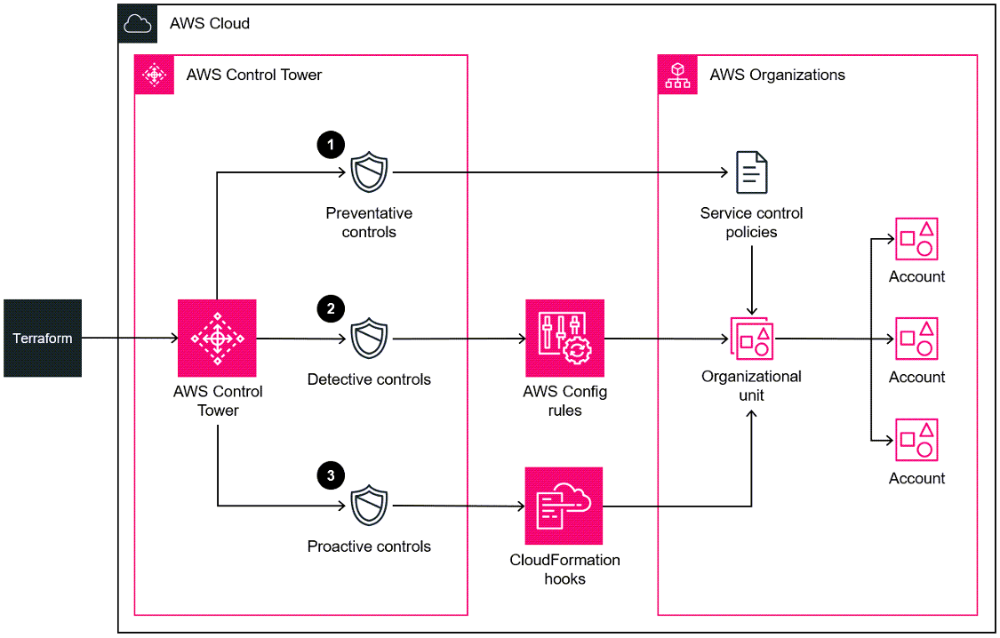

# Deploy and manage AWS Control Tower controls by using Terraform


- [AWS Prescriptive Guidance](#aws-prescriptive-guidance)
- [Goal](#goal)
- [Prerequisites and Limitations](#prerequisites-and-limitations)
- [Architecture](#architecture)
- [Tools](#tools)
- [Best practices](#best-practices)
- [Control Behavior And Guidance](#control-behavior-and-guidance)
- [Setup](#setup)
  - [Requirements](#requirements)
  - [Resources](#resources)
  - [Inputs](#inputs)
  - [Outputs](#outputs)
- [Controls Configuration File](#controls-configuration-file)
- [Authors](#authors)
- [Security](#security)
- [License](#license)

## AWS Prescriptive Guidance

For a complete guide, prerequisites and instructions for using this AWS Prescriptive Guidance pattern, see [Deploy and manage AWS Control Tower controls by using Terraform](https://docs.aws.amazon.com/prescriptive-guidance/latest/patterns/deploy-and-manage-aws-control-tower-controls-by-using-terraform.html).

## Goal

This pattern describes how to use AWS Control Tower controls, HashiCorp Terraform, and infrastructure as code (IaC) to implement and administer preventive, detective, and proactive security controls. A [control](https://docs.aws.amazon.com/controltower/latest/userguide/controls.html) (also known as a guardrail) is a high-level rule that provides ongoing governance for your overall AWS Control Tower environment. For example, you can use controls to require logging for your AWS accounts and then configure automatic notifications if specific security-related events occur.

AWS Control Tower helps you implement preventive, detective, and proactive controls that govern your AWS resources and monitor compliance across multiple AWS accounts. Each control enforces a single rule. In this pattern, you use a provided IaC template to specify which controls you want to deploy in your environment.

AWS Control Tower controls apply to an entire [organizational unit (OU)](https://docs.aws.amazon.com/organizations/latest/userguide/orgs_getting-started_concepts.html#organizationalunit), and the control affects every AWS account within the OU. Therefore, when users perform any action in any account in your landing zone, the action is subject to the controls that govern the OU.

Implementing AWS Control Tower controls helps establish a strong security foundation for your AWS landing zone. By using this pattern to deploy the controls as IaC through Terraform, you can standardize the controls in your landing zone and more efficiently deploy and manage them.

### Intended Audience

This pattern is recommended for users who have experience with AWS Control Tower, Terraform, and AWS Organizations.


## Prerequisites and Limitations

### Prerequisites

- Active AWS accounts managed as an organization in AWS Organizations and an AWS Control Tower landing zone. For instructions, see [Getting started](https://docs.aws.amazon.com/controltower/latest/userguide/getting-started-with-control-tower.html) in the AWS Control Tower documentation.

- AWS Command Line Interface (AWS CLI), [installed](https://docs.aws.amazon.com/cli/latest/userguide/getting-started-install.html) and [configured](https://docs.aws.amazon.com/cli/latest/userguide/cli-configure-files.html).

- An AWS Identity and Access Management (IAM) role in the management account that has permissions to deploy this pattern. For more information about the required permissions and a sample policy, see Least privilege permissions for the IAM role in the [Additional information](https://docs.aws.amazon.com/prescriptive-guidance/latest/patterns/deploy-and-manage-aws-control-tower-controls-by-using-terraform.html#deploy-and-manage-aws-control-tower-controls-by-using-terraform-additional) section of this pattern.

- Permissions to assume the IAM role in the management account.

- Apply the service control policy (SCP)-based control with the identifier CLOUDFORMATION.PR.1. This SCP must be activated to deploy proactive controls. For instructions, see [Disallow management of resource types, modules, and hooks within the AWS CloudFormation registry.](https://docs.aws.amazon.com/controltower/latest/userguide/elective-controls.html#disallow-cfn-extensions)

- Terraform CLI, [installed](https://developer.hashicorp.com/terraform/cli) (Terraform documentation).

- Terraform AWS Provider, [configured](https://hashicorp.github.io/terraform-provider-aws/) (Terraform documentation).

- Terraform backend, [configured](https://developer.hashicorp.com/terraform/language/settings/backends/configuration#using-a-backend-block) (Terraform documentation).

### Limitations

- For AWS Control Tower controls, this pattern requires the use of [global identifiers](https://docs.aws.amazon.com/controltower/latest/controlreference/all-global-identifiers.html) that are in the following format:
`arn:<PARTITION>:controlcatalog:::control/<CONTROL_CATALOG_OPAQUE_ID>`
**Note:** In most cases, the value for `<PARTITION>` is aws.
Previous versions of this pattern used [regional identifiers](https://docs.aws.amazon.com/controltower/latest/controlreference/control-metadata-tables.html) that are no longer supported. We recommend that you migrate from regional identifiers to global identifiers. Global identifiers help you manage controls and expand the number of controls you can use.


## Architecture

This section provides a high-level overview of this solution and the architecture established by the sample code. The following diagram shows controls deployed across the various accounts in the OU.



AWS Control Tower controls are categorized according to their behavior and their guidance.

There are three primary types of control behaviors:

1.	Preventive controls are designed to prevent actions from occurring. These are implemented with [service control policies (SCPs)](https://docs.aws.amazon.com/organizations/latest/userguide/orgs_manage_policies_scps.html) or [resource control policies (RCPs)](https://docs.aws.amazon.com/organizations/latest/userguide/orgs_manage_policies_rcps.html) in AWS Organizations. The status of a preventive control is either enforced or not enabled. Preventive controls are supported in all AWS Regions.

2. Detective controls are designed to detect specific events when they occur and log the action in CloudTrail. These are implemented with AWS [Config rules](https://docs.aws.amazon.com/config/latest/developerguide/evaluate-config.html). The status of a detective control is either clear, in violation, or not enabled. Detective controls apply only in those AWS Regions supported by AWS Control Tower.

3. Proactive controls scan resources that would be provisioned by AWS CloudFormation and check whether they are compliant with your company policies and objectives. Resources that are not compliant will not be provisioned. These are implemented with AWS [CloudFormation hooks](https://docs.aws.amazon.com/cloudformation-cli/latest/userguide/hooks.htmlhttps:/docs.aws.amazon.com/cloudformation-cli/latest/userguide/hooks.html). The status of a proactive control is PASS, FAIL, or SKIP.

Control guidance refers to the recommended practice for how to apply each control to your OUs. AWS Control Tower provides three categories of guidance: mandatory, strongly recommended, and elective. The guidance of a control is independent of its behavior. For more information, see [Control behavior and guidance](https://docs.aws.amazon.com/controltower/latest/userguide/controls.html#control-behavior).


## Tools

### AWS services

- [AWS CloudFormation](https://docs.aws.amazon.com/AWSCloudFormation/latest/UserGuide/Welcome.html) helps you set up AWS resources, provision them quickly and consistently, and manage them throughout their lifecycle across AWS accounts and Regions.

- [AWS Config](https://docs.aws.amazon.com/config/latest/developerguide/WhatIsConfig.html) provides a detailed view of the resources in your AWS account and how they’re configured. It helps you identify how resources are related to one another and how their configurations have changed over time.

- [AWS Control Tower](https://docs.aws.amazon.com/controltower/latest/userguide/what-is-control-tower.html) helps you set up and govern an AWS multi-account environment, following prescriptive best practices.

- [AWS Organizations](https://docs.aws.amazon.com/organizations/latest/userguide/orgs_introduction.html) is an account management service that helps you consolidate multiple AWS accounts into an organization that you create and centrally manage.

### Other tools

- [HashiCorp Terraform](https://www.terraform.io/docs) is an open-source infrastructure as code (IaC) tool that helps you use code to provision and manage cloud infrastructure and resources.

## Best practices

- The IAM role used to deploy this solution should adhere to the [principle of least-privilege](https://docs.aws.amazon.com/IAM/latest/UserGuide/best-practices.html#grant-least-privilege) (IAM documentation).

- Adhere to the [Best practices for AWS Control Tower administrators](https://docs.aws.amazon.com/controltower/latest/userguide/best-practices.html) (AWS Control Tower documentation).


## Control Behavior And Guidance

[Controls are categorized according to their behavior and their guidance.](https://docs.aws.amazon.com/controltower/latest/userguide/controls.html)

[For a full list of preventive, detective and proactive available controls, see the The AWS Control Tower controls library.](https://docs.aws.amazon.com/controltower/latest/userguide/controls-reference.html)


## Setup

To deploy this solution, you need

| Name | Version |
|------|---------|
| <a name="requirement_ct"></a> [AWS Control Tower](https://aws.amazon.com/controltower/) | >= 3.2 |

and the following requirements.

<!-- BEGIN_TF_DOCS -->
## Requirements

| Name | Version |
|------|---------|
| <a name="requirement_terraform"></a> [terraform](#requirement\_terraform) | > 1.5 |
| <a name="requirement_aws"></a> [aws](#requirement\_aws) | > 4.67 |

## Providers

| Name | Version |
|------|---------|
| <a name="provider_aws"></a> [aws](#provider\_aws) | 5.81.0 |

## Modules

No modules.

## Resources

| Name | Type |
|------|------|
| [aws_controltower_control.guardrails](https://registry.terraform.io/providers/hashicorp/aws/latest/docs/resources/controltower_control) | resource |
| [aws_organizations_organization.organization](https://registry.terraform.io/providers/hashicorp/aws/latest/docs/data-sources/organizations_organization) | data source |
| [aws_organizations_organizational_units.ous_depth_1](https://registry.terraform.io/providers/hashicorp/aws/latest/docs/data-sources/organizations_organizational_units) | data source |
| [aws_organizations_organizational_units.ous_depth_2](https://registry.terraform.io/providers/hashicorp/aws/latest/docs/data-sources/organizations_organizational_units) | data source |
| [aws_organizations_organizational_units.ous_depth_3](https://registry.terraform.io/providers/hashicorp/aws/latest/docs/data-sources/organizations_organizational_units) | data source |
| [aws_organizations_organizational_units.ous_depth_4](https://registry.terraform.io/providers/hashicorp/aws/latest/docs/data-sources/organizations_organizational_units) | data source |
| [aws_organizations_organizational_units.root](https://registry.terraform.io/providers/hashicorp/aws/latest/docs/data-sources/organizations_organizational_units) | data source |

## Inputs

| Name | Description | Type | Default | Required |
|------|-------------|------|---------|:--------:|
| <a name="input_controls"></a> [controls](#input\_controls) | Configuration of AWS Control Tower Guardrails for the whole organization | <pre>list(object({<br>    control_names           = list(string)<br>    organizational_unit_ids = list(string)<br>  }))</pre> | n/a | yes |

## Outputs

| Name | Description |
|------|-------------|
| <a name="output_ous_id_to_arn_map"></a> [ous\_id\_to\_arn\_map](#output\_ous\_id\_to\_arn\_map) | Map from OU id to OU arn for the whole organization |
<!-- END_TF_DOCS -->


## Controls Configuration File

The following is an example of an updated `variables.tfvars` file.
```
controls = [
    {
        control_names = [
            "503uicglhjkokaajywfpt6ros",
            ...
        ],
        organizational_unit_ids = ["ou-1111-11111111", "ou-2222-22222222"...],
    },
    {
        control_names = [
            "50z1ot237wl8u1lv5ufau6qqo",
            ...
        ],
        organizational_unit_ids = ["ou-1111-11111111"...],
    },
]
```

1. Open [All global identifiers](https://docs.aws.amazon.com/controltower/latest/controlreference/all-global-identifiers.html) in the AWS Control Tower documentation.

2. In the JSON-formatted list, locate the control that you want to implement, and then copy its global identifier (also known as the `{CONTROL_CATALOG_OPAQUE_ID}` value). For example, the global identifier for the `AWS-GR_AUDIT_BUCKET_ENCRYPTION_ENABLED` control is `k4izcjxhukijhajp6ks5mjxk`.

3. In the `controls` section, in the `control_names` parameter, enter the global identifier that you copied.

4. In the `controls` section, in the `organizational_unit_ids` parameter, enter the ID of the organizational unit where you want to enable the control, such as `ou-1111-11111111`. Enter the ID in double quotation marks, and separate multiple IDs with commas. For more information about how to retrieve OU IDs, see Viewing the [details of an OU](https://docs.aws.amazon.com/organizations/latest/userguide/orgs_manage_org_details.html#orgs_view_ou).

5. Save and close the variables.tfvars file. For an example of an updated variables.tfvars file, see the [Additional information](https://docs.aws.amazon.com/prescriptive-guidance/latest/patterns/deploy-and-manage-aws-control-tower-controls-by-using-terraform.html#deploy-and-manage-aws-control-tower-controls-by-using-terraform-additional) section of this pattern.


## Deployment


In the management account, assume the IAM role that has permissions to deploy the Terraform configuration file. For more information about the permissions required and a sample policy, see Least privilege permissions for the IAM role in the [Additional information](https://docs.aws.amazon.com/prescriptive-guidance/latest/patterns/deploy-and-manage-aws-control-tower-controls-by-using-terraform.html#deploy-and-manage-aws-control-tower-controls-by-using-terraform-additional) section. For more information about assuming an IAM role in the AWS CLI, see [Use an IAM role in the AWS CLI](https://docs.aws.amazon.com/cli/latest/userguide/cli-configure-role.html).

1. Enter the following command to initialize Terraform.
```
$ terraform init -upgrade
```
2. Enter the following command to preview the changes compared the current state.

```
$ terraform plan -var-file="variables.tfvars"
```
3. Review the configuration changes in the Terraform plan and confirm that you want to implement these changes in the organization.

4. Enter the following command to deploy the resources.
```
$ terraform apply -var-file="variables.tfvars"
```
5. (optional) Enter the following command to remove the resources deployed by this pattern.
```
$ terraform destroy -var-file="variables.tfvars"
```

## Least privilege permissions for the IAM role

This APG pattern requires that you assume an IAM role in the management account. Best practice is to assume a role with temporary permissions and limit the permissions according to the principle of least privilege. The following sample policy allows the minimum actions required to enable or disable AWS Control Tower controls.
```
{
    "Version": "2012-10-17",
    "Statement": [
        {
            "Effect": "Allow",
            "Action": [
                "controltower:EnableControl",
                "controltower:DisableControl",
                "controltower:GetControlOperation",
                "controltower:ListEnabledControls",
                "organizations:AttachPolicy",
                "organizations:CreatePolicy",
                "organizations:DeletePolicy",
                "organizations:DescribeOrganization",
                "organizations:DetachPolicy",
                "organizations:ListAccounts",
                "organizations:ListAWSServiceAccessForOrganization",
                "organizations:ListChildren",
                "organizations:ListOrganizationalUnitsForParent",
                "organizations:ListParents",
                "organizations:ListPoliciesForTarget",
                "organizations:ListRoots",
                "organizations:UpdatePolicy"
            ],
            "Resource": "*"
        }
    ]
}
```


## Authors

Pattern created by Ivan Girardi (AWS) and Iker Reina Fuente (AWS).

## Security

See [CONTRIBUTING](CONTRIBUTING.md#security-issue-notifications) for more information.

## License

This library is licensed under the MIT-0 License. See the [LICENSE](LICENSE) file.
