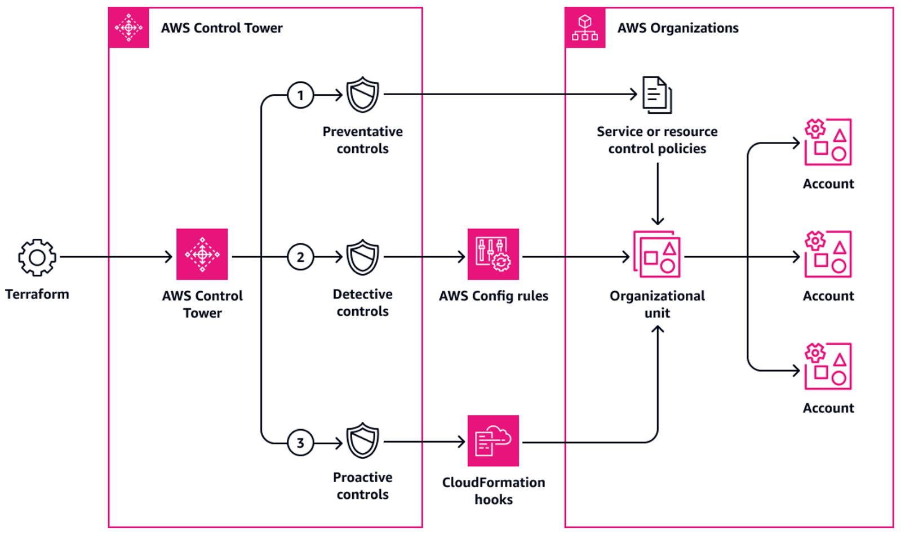

# CTC - Deploy and manage AWS Control Tower Controls (sometimes called guardrails) using Terraform and infrastructure as code


- [Goal](#goal)
- [Overview](#overview)
- [Setup](#setup)
  - [Requirements](#requirements)
  - [Resources](#resources)
  - [Inputs](#inputs)
  - [Outputs](#outputs)
- [Controls Configuration File](#controls-configuration-file)
- [Control Behavior And Guidance](#control-behavior-and-guidance)
- [Deployment](#deployment)


## Goal

This pattern describes how to use AWS Control Tower Controls, Terraform and infrastructure as code (IaC) to implement and administer preventive, detective and proactive security on the Amazon Web Services (AWS) Cloud, for example, you can use controls to help ensure that security logs and necessary cross-account access permissions are created, and not altered.

This IaC artifact (CTC or ControlTowerControls) is a collection of reusable resources that accelerate the delivery of preventive, detective and proactive security controls (sometimes called guardrails) on the AWS Cloud and helps with faster deployment to production. It is used to implement the foundational structure of an organization by following AWS Control Tower best practices.

CTC implements a deployment process throughout IaC deployment by using services such Terraform.

Terraform service act as the IaC layer to provide reproducible and fast deployments with easy operations and administration.

A control is a high-level rule that provides ongoing governance for your overall AWS environment. It's expressed in plain language. AWS Control Tower implements preventive, detective, and proactive controls that help you govern your resources and monitor compliance across groups of AWS accounts.

A control applies to an entire organizational unit (OU), and every AWS account within the OU is affected by the control. Therefore, when users perform work in any AWS account in your landing zone, they're always subject to the controls that are governing their account's OU.

## Overview

The solution consists of the following:
- A **set of Control Tower controls** to be deployed in the Control Tower master account with the desired controls to be deploy in the Lanzing Zone.




## Setup

To deploy this solution, you need

| Name | Version |
|------|---------|
| <a name="requirement_ct"></a> [AWS Control Tower](https://aws.amazon.com/controltower/) | >= 3.0 |

and the following requirements.

<!-- BEGINNING OF PRE-COMMIT-TERRAFORM DOCS HOOK -->
## Requirements

| Name | Version |
|------|---------|
| <a name="requirement_terraform"></a> [terraform](#requirement\_terraform) | ~> 1.5 |
| <a name="requirement_aws"></a> [aws](#requirement\_aws) | ~> 4.67 |

## Providers

| Name | Version |
|------|---------|
| <a name="provider_aws"></a> [aws](#provider\_aws) | 4.67.0 |

## Modules

No modules.

## Resources

| Name | Type |
|------|------|
| [aws_controltower_control.guardrails](https://registry.terraform.io/providers/hashicorp/aws/latest/docs/resources/controltower_control) | resource |
| [aws_organizations_organization.organization](https://registry.terraform.io/providers/hashicorp/aws/latest/docs/data-sources/organizations_organization) | data source |
| [aws_organizations_organizational_units.ous_depth_1](https://registry.terraform.io/providers/hashicorp/aws/latest/docs/data-sources/organizations_organizational_units) | data source |
| [aws_organizations_organizational_units.ous_depth_2](https://registry.terraform.io/providers/hashicorp/aws/latest/docs/data-sources/organizations_organizational_units) | data source |
| [aws_organizations_organizational_units.ous_depth_3](https://registry.terraform.io/providers/hashicorp/aws/latest/docs/data-sources/organizations_organizational_units) | data source |
| [aws_organizations_organizational_units.ous_depth_4](https://registry.terraform.io/providers/hashicorp/aws/latest/docs/data-sources/organizations_organizational_units) | data source |
| [aws_organizations_organizational_units.root](https://registry.terraform.io/providers/hashicorp/aws/latest/docs/data-sources/organizations_organizational_units) | data source |
| [aws_region.current](https://registry.terraform.io/providers/hashicorp/aws/latest/docs/data-sources/region) | data source |

## Inputs

| Name | Description | Type | Default | Required |
|------|-------------|------|---------|:--------:|
| <a name="input_controls"></a> [controls](#input\_controls) | Configuration of AWS Control Tower Guardrails for the whole organization | <pre>list(object({<br>    control_names           = list(string)<br>    organizational_unit_ids = list(string)<br>  }))</pre> | n/a | yes |

## Outputs

| Name | Description |
|------|-------------|
| <a name="output_ous_id_to_arn_map"></a> [ous\_id\_to\_arn\_map](#output\_ous\_id\_to\_arn\_map) | Map from OU id to OU arn for the whole organization |
<!-- END OF PRE-COMMIT-TERRAFORM DOCS HOOK -->


Also, make sure that for deploying [proactive](https://docs.aws.amazon.com/controltower/latest/userguide/proactive-controls.html) controls you must previously apply an elective, SCP-based control with the identifier **CT.CLOUDFORMATION.PR.1** before you can activate proactive controls on an OU. See Disallow management of resource types, modules, and hooks within the AWS CloudFormation registry. If this SCP is not activated, you'll see an error message directing you to enable this control as a prerequisite, or showing it as a dependency for other proactive controls.

## Controls Configuration File
Update the configuration file `variables.tfvars` like this example:
```
controls = [
    {
        control_names = [
            "AWS-GR_ENCRYPTED_VOLUMES",
            ...
        ],
        organizational_unit_ids = ["<Organizational Unit Id>", "<Organizational Unit Id>"...],
    },
    {
        control_names = [
            "AWS-GR_SUBNET_AUTO_ASSIGN_PUBLIC_IP_DISABLED",
            ...
        ],
        organizational_unit_ids = ["<Organizational Unit Id>"...],
    },
]
```

The organizational unit ids should follow the pattern `^ou-[0-9a-z]{4,32}-[a-z0-9]{8,32}$`, for example, `ou-1111-11111111`.

The `control_names` are found after the `“/”` of the `API controlIdentifier` see the next example of an `API controlIdentifier`: `arn:aws:controltower:REGION::control/CONTROL_NAME`.


## Control Behavior And Guidance

[Controls are categorized according to their behavior and their guidance.](https://docs.aws.amazon.com/controltower/latest/userguide/controls.html)

[For a full list of preventive, detective and proactive available controls, see the The AWS Control Tower controls library.](https://docs.aws.amazon.com/controltower/latest/userguide/controls-reference.html)


## Deployment

Initialize Terraform.
```
$ terraform init -upgrade
```
Visualize the changes.

```
$ terraform plan -var-file="variables.tfvars"
```
Deploy the resources.
```
$ terraform apply -var-file="variables.tfvars"
```
Execute the following command to remove and cleanup the resources created in the previous step.
```
$ terraform destroy -var-file="variables.tfvars"
```

## Authors

Pattern created by Ivan Girardi (AWS) and Iker Reina Fuente (AWS).

## Security

See [CONTRIBUTING](CONTRIBUTING.md#security-issue-notifications) for more information.

## License

This library is licensed under the MIT-0 License. See the [LICENSE](LICENSE) file.
